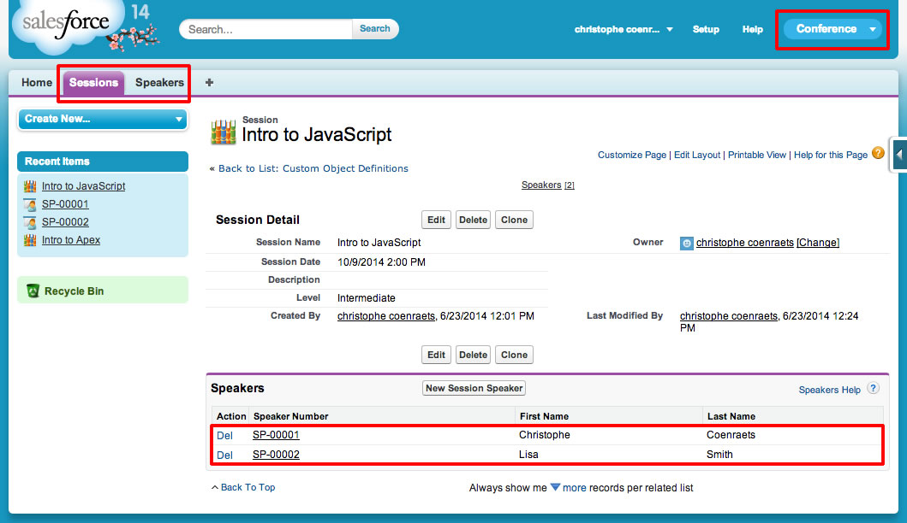
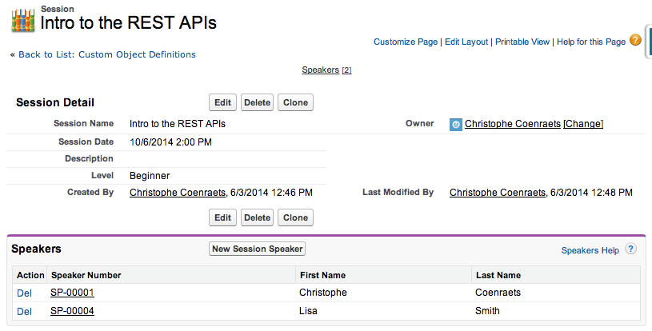
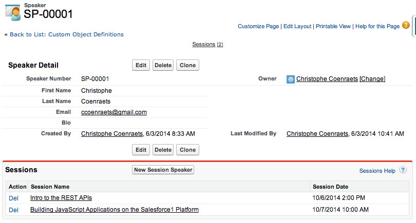
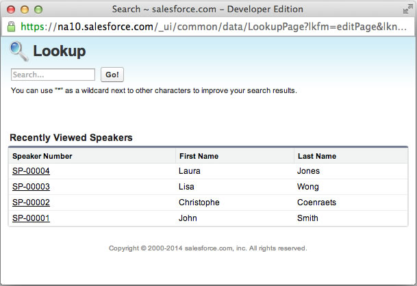

In this module, you create Tabs to provide access to the Session and Speaker objects, you group these tabs together in an Application to make them easier to access, and you optimize Page Layouts to show relevant information in the Speaker and Session lists.

### Step 1: Creating Tabs

To create the Sessions tab:

1. In **Setup**, select **Build** > **Create** > **Tabs**

1. In the **Custom Object Tabs** section, click **New**

1. Select the **Session** object and **Books** as the Tab Style Icon

1. Click **Next**, **Next**

1. Uncheck the **Include Tab** checkbox to ensure the Sessions tab doesn't appear in any of the existing applications, and click **Save** (In step 2, we will add the Sessions tab to a new application). 

To create the Speakers tab:

1. In the **Custom Object Tabs** section, click New

1. Select the **Speaker** object and **Presenter** as the Tab Style Icon

1. Click **Next**, **Next**

1. Uncheck the **Include Tab** checkbox to ensure the Speakers tab doesn't appear in any of the existing applications, and click **Save**

### Step 2: Creating the App

A Salesforce App is a group of Tabs that makes it easy for users to access a set of related features.

1. In **Setup**, select **Build** > **Create** > **Apps**

1. In the **Apps** section, click **New**

1. Check **Custom app** and click **Next**

1. Enter **MyConference** for both the App Label and App Name, and click **Next**

1. Accept the default App Logo and click **Next**

1. Add the **Sessions** and **Speakers** tabs to the **Selected Tabs** and click **Next**

1. Check the **System Administrator** profile and click **Save**

1. Select **MyConference** in the App selector (upper right corner of the screen)

> If the MyConference App doesn't appear in the App Selector, you probably forgot to assign it to the System Administrator profile. In Setup, select Build > Create > App, click Edit next to MyConference, check the System Administrator profile, and click Save.

### Step 3: Enter Sample Data

1. Click the Sessions Tab, click **New**, and  add a few sample sessions

1. Click the Speakers Tab, click **New**, and add a few sample speakers

1. Click **New Session Speaker** to assign speakers to a session in the Session view, or sessions to a speaker in the Speaker view

### Step 4: Optimize the Session Page Layout

In this step, you optimize the Session details screen: to allow the user to easily identify the speakers for a session, you add the appropriate fields to the Speaker list.  

1. In **Setup**, select **Build** > **Create** > **Objects**

1. Click the **Session** link

1. In the **Page Layouts** section, click **Edit** next to Session Layout

1. In the **Related Lists** section, click the wrench icon (Related list properties)

1. Remove **Session Speaker: Session Speaker Name** from the **Selected Fields**

1. Add **Speaker: Speaker Number**, **Speaker: First Name**, and **Speaker: Last Name** to the **Selected Fields**

1. Click **OK**

1. Click **Save** (upper left corner)

### Step 5: Optimize the Speaker Page Layout

In this step, you optimize the Speaker details screen: to allow the user to easily identify the sessions for a speaker, you add the appropriate fields to the Session list.  

1. In **Setup**, select **Build** > **Create** > **Objects**

1. Click the **Speaker** link

1. In the **Page Layouts** section, click **Edit** next to Speaker Layout

1. In the **Related Lists** section, click the wrench icon (Related list properties)

1. Remove **Session Speaker: Session Speaker Name** from the **Selected Fields**

1. Add **Session: Session Name** and **Session: Session Date** to the **Selected Fields**

1. Click **OK**

1. Click **Save** (upper left corner)

### Step 6: Optimize the Speaker Lookup

In this step, you optimize the Speaker lookup dialog to allow the user to easily identify speakers.  

1. In the **Search Layouts** section, click **Edit** next to **Lookup Dialogs**

1. Add **First Name** and **Last Name** to the **Selected Fields**

1. Click **Save**

### Step 7: Test the Application

1. Click the Sessions tab, select a session and make sure the speaker list shows the speaker number, first name, and last name
  
1. Assign a new speaker to a session and make sure the speaker lookup dialog shows the speaker first name and last name
  
1. Click the Speakers tab, select a speaker and make sure the session list shows the session name and date

> If the lists don't show the expected fields, you probably forgot to click the Save button in the Page Layout screen. Go back to steps 4 and 5, and make sure you click Save at the end. 
  