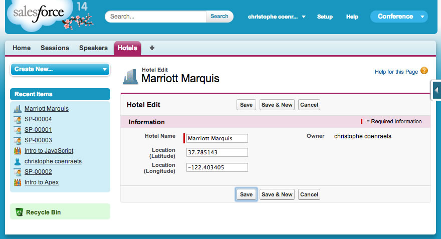

In this module, you create a custom controller with a method that returns a list of conference hotels. You create a Visualforce page that invokes that method using JavaScript Remoting, and uses the Google Maps SDK to display the hotels on a map.


## Step 1: Create the Hotel Object

1. In **Setup**, select **Build** > **Create** > **Objects**

2. Click **New Custom Object**, and define the Hotel Object as follows:
  - Label: **Hotel**
  - Plural Label: **Hotels**
  - Object Name: **Hotel**
  - Record Name: **Hotel Name**
  - Data Type: **Text**

3. Click **Save**

4. In the **Custom Fields & Relationships** section, click **New**, and create a **Location** field defined as follows:
      - Data Type: **Geolocation**
      - Field Label: **Location**
      - Latitude and Longitude Display Notation: **Decimal**
      - Decimal Places: **7**
      - Field Name: **Location**

    Click **Next**, **Next**, **Save**

5. Create a Tab for the Hotel object
  - In **Setup**, select **Build** > **Create** > **Tabs**
  - In the **Custom Object Tabs** section, click **New**
  - Select the **Hotel** object and **Building** as the Tab Style Icon
  - Click **Next**, **Next**
  - Uncheck the **Include Tab** checkbox, check the **Conference** checkbox, and click **Save**

    

6. Enter a couple of hotels with location information. For example:
  - Marriott Marquis (37.785143 -122.403405)
  - Hilton Union Square (37.786164 -122.410137)
  - Hyatt (37.794157 -122.396311)

    

## Step 2: Create the HotelRemoter Controller

1. In the Developer Console, select **File** > **New** > **Apex Class**, specify **HotelRemoter** as the class name and click **OK**

1. Implement the class as follows:

    ```
    global with sharing class HotelRemoter {

        @RemoteAction
        global static List<Hotel__c> findAll() {
            return [SELECT Id, Name, Location__Latitude__s, Location__Longitude__s
                        FROM Hotel__c];
        }

    }
    ```

1. Save the file  

## Step 3: Create a Visualforce Page with Google Maps

1. In the Developer Console, select **File** > **New** > **Visualforce Page**, specify **HotelMap** as the page name and click **OK**

1. Implement HotelMap as follows:

  ```
  <apex:page sidebar="false" showheader="false">

  <head>
    <style type="text/css">
      html { height: 100% }
      body { height: 100%; margin: 0; padding: 0 }
      #map-canvas { height: 100% }
    </style>
    <script src="https://maps.googleapis.com/maps/api/js?sensor=false"></script>
    <script>
    var map;

    function initialize() {
        var mapOptions = {
            center: new google.maps.LatLng(37.784173, -122.401557),
            zoom: 15
        };
        map = new google.maps.Map(document.getElementById("map-canvas"), mapOptions);
    }

    google.maps.event.addDomListener(window, 'load', initialize);

  </script>
  </head>
  <body>
      <div id="map-canvas"/>
  </body>

  </apex:page>
  ```

1. Save the file

1. Click the **Preview** button (upper left corner) to test the HotelMap page in the browser

## Step 4: Display the Hotels on the Map

1. Assign **HotelRemoter** as the controller for the **HotelMap** Visualforce page:

  ```
  <apex:page sidebar="false" showheader="false" controller="HotelRemoter">
  ```

1. Define a function named loadHotels() implemented as follows (right after the initilize() function):

    ```
    function loadHotels() {
        Visualforce.remoting.Manager.invokeAction('{!$RemoteAction.HotelRemoter.findAll}',
            function(result, event){
                if (event.status) {
                    for (var i=0; i<result.length; i++) {
                        var id = result[i].Id;
                        var name = result[i].Name;
                        var lat = result[i].Location__Latitude__s;
                        var lng = result[i].Location__Longitude__s;
                        addMarker(id, name, lat, lng);
                    }
                } else {
                    alert(event.message);
                }
            },
            {escape: true}
        );
    }
    ```

1. Define the addMarker() function implemented as follows (right after the loadHotels() function):

    ```
    function addMarker(id, name, lat, lng) {
        var marker = new google.maps.Marker({
      			position: new google.maps.LatLng(lat, lng),
      			map: map,
      			title: name
        });
        google.maps.event.addListener(marker, 'click', function(event) {
            window.top.location = '/' + id;
        });
  	}
    ```

1. Invoke loadHotels() as the last line of the **initialize()** function:

  ```
  loadHotels();
  ```

1. Save the file

1. Click the **Preview** button (upper left corner) to test the HotelMap page in the browser. You should now see markers on the map representing the hotels you entered in Step 1.


<div class="row" style="margin-top:40px;">
<div class="col-sm-12">
<a href="Creating-a-Controller-Extension.html" class="btn btn-default"><i class="glyphicon glyphicon-chevron-left"></i> Previous</a>
<a href="Using-the-Salesforce1-Platform-APIs.html" class="btn btn-default pull-right">Next <i class="glyphicon glyphicon-chevron-right"></i></a>
</div>
</div>
