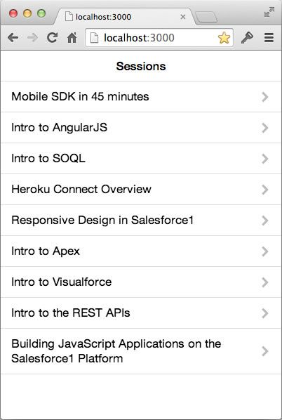

In this module, you create an application that runs outside your Salesforce instance: it uses OAuth to authenticate with Salesforce, and the REST APIs to access Salesforce data.



### Requirement

You need Node.js to perform the exercises this module. If you don't already have Node.js installed on your system, you can install it [here](http://nodejs.org/).

### Step 1: Create a Connected App

1. In Setup, click **Build** > **Create** > **Apps**

1. In the Connected Apps section, click **New**, and define the Connected App as follows:

    

1. Click **Save**.

### Step 2: Start the Node.js server

1. Download and unzip [this file](https://github.com/ccoenraets/salesforce-developer-workshop/archive/master.zip), or clone [this repository](https://github.com/ccoenraets/salesforce-developer-workshop)

1. Open Terminal (Mac) or a Command prompt (Windows)

1. Navigate to the **salesforce-developer-workshop** (or salesforce-developer-workshop-master) directory

1. Install the Node.js server dependencies:

  ```
  npm install
  ```

1. Start the server:  

  ```
  node server
  ```

1. Test the application. Open a browser and access the following URL:

  ```
  http://localhost:3000
  ```

  Since we didn't authenticate with Salesforce yet, all you should see at this point is an empty list of sessions.

### Step 3: Authenticate with Salesforce using OAuth

1. Using your favorite code editor, open **app.js** in **salesforce-developer-workshop/client/js**

1. Declare the following variables:

  ```
  var apiVersion = 'v30.0',
    clientId = 'YOUR_CONSUMER_KEY',
    loginUrl = 'https://login.salesforce.com/',
    redirectURI = 'http://localhost:3000/oauthcallback.html',
    proxyURL = 'http://localhost:3000/proxy/',
    client = new forcetk.Client(clientId, loginUrl, proxyURL);
  ```

1. In **Setup** (back in Salesforce), click **Build** > **Create** > **Apps**. In the **Connected Apps** section, click **MyConference**, and copy the **Consumer Key** to your clipboard.

1. In app.js, replace YOUR_CONSUMER_KEY with the consumer key you copied to your clipboard

1. Declare a function named **login()** implemented as follows:

    ```
    function login() {
        var url = loginUrl + 'services/oauth2/authorize?display=popup&response_type=token'
                    + '&client_id=' + encodeURIComponent(clientId)
                    + '&redirect_uri=' + encodeURIComponent(redirectURI);
        window.open(url);
    }
    ```

1. Declare a function named **oauthCallback()** implemented as follows:

    ```
    function oauthCallback(response) {
        if (response && response.access_token) {
            client.setSessionToken(response.access_token, 
                                   apiVersion, 
                                   response.instance_url);
            console.log('OAuth authentication succeeded');
        } else {
            alert("AuthenticationError: No Token");
        }
    }
    ```

1. Invoke the login() function as the last line of the app.js file:

  ```
  login();
  ```

1. Test the application

  - Open a browser and access http://localhost:3000
  - Login with your Developer Edition credentials
  - Open the browser console: you should see the **OAuth authentication succeeded** message


### Step 4: Using the REST APIs

1. In app.js, declare a function named **getSessions()** implemented as follows:

    ```
    function getSessions() {
        var soql = "SELECT Id, Name, Session_Date__c FROM Session__c",
            html = '';
        client.query(soql,
            function (data) {
                var sessions = data.records;
                for (var i=0; i<sessions.length; i++) {
                    html += '<li class="table-view-cell">' + sessions[i].Name + '</li>';
                }
                $('.session-list').html(html);
            },
            function (error) {
                alert("Error: " + JSON.stringify(error));
            });
        return false;
    }
    ```

1. Modify the oauthCallback() function to invoke getSessions() when the user has been successfully authenticated.

  ```
  console.log('OAuth authentication succeeded');
  getSessions();
  ```

1. Test the application

  - Open a browser and access http://localhost:3000
  - Login with your Developer Edition credentials
  - You should now see the list of sessions
