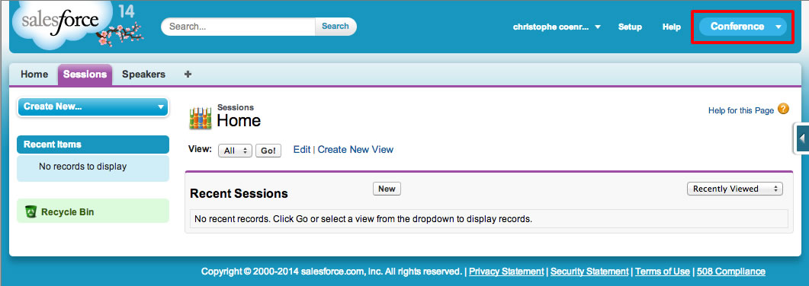
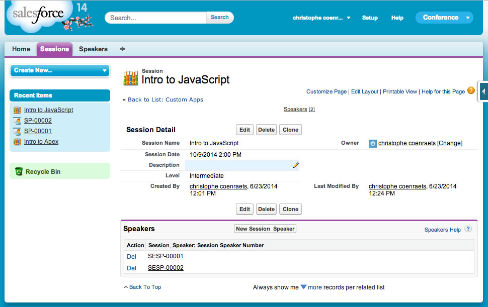
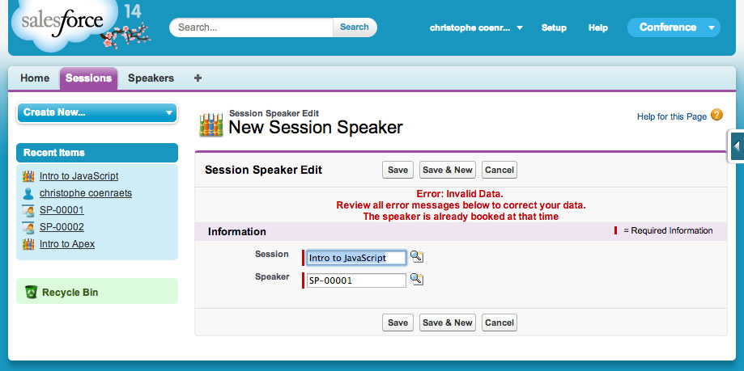
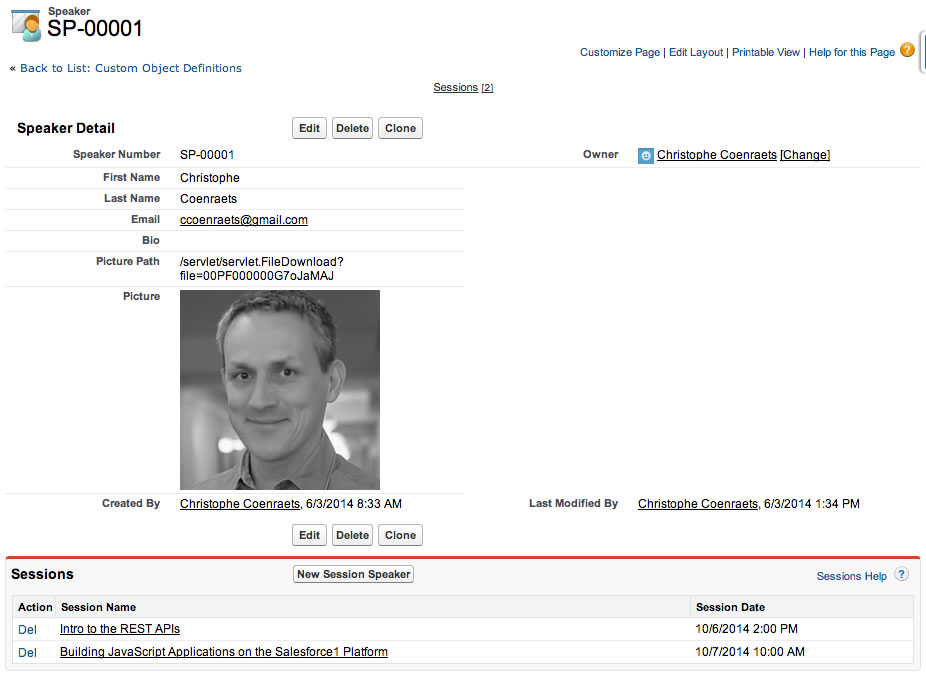
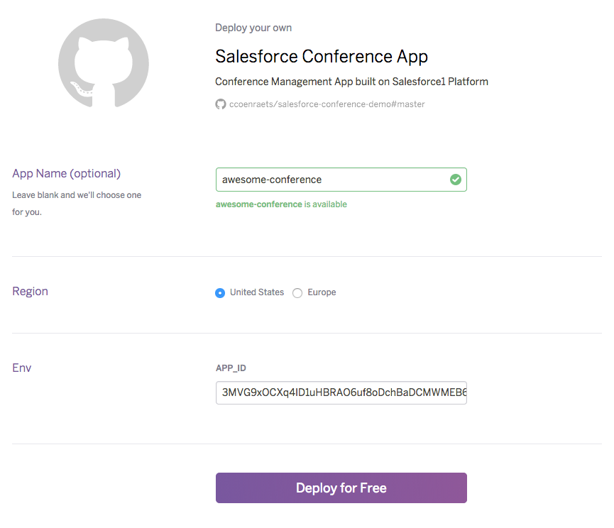
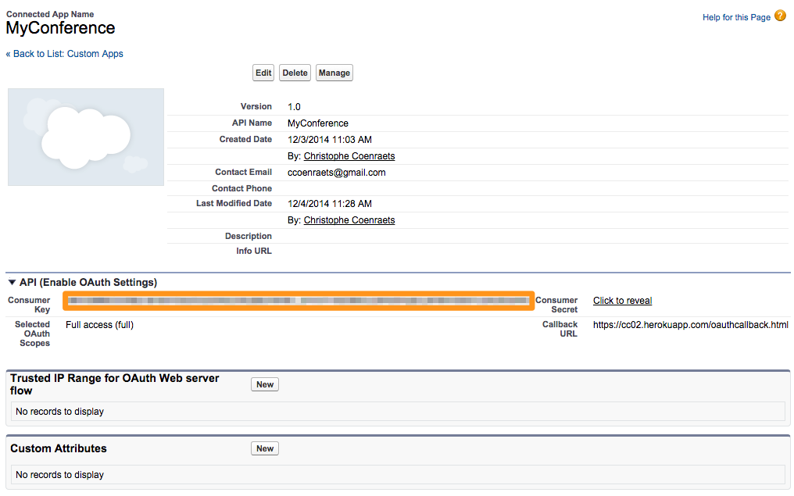
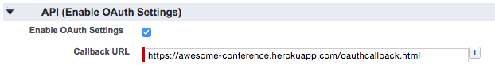
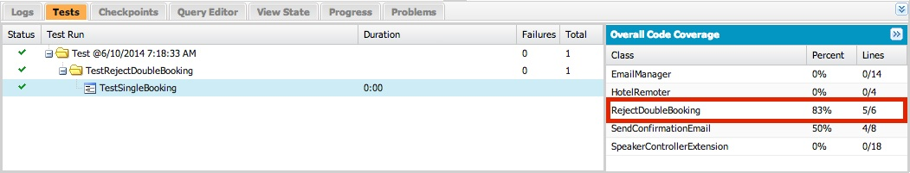
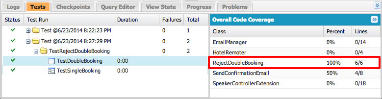

## Overview

In this tutorial, you use the Salesforce Platform to build a conference management application that allows conference 
administrators to manage all the
aspects of a conference: sessions, speakers, hotels, etc. You also create a simple consumer-facing application that allows conference attendees to view the conference schedule, and learn more about sessions and speakers.

## What You Will Learn

- Create Custom Objects
- Use declarative features of the platform to create an Application, create Tabs, and optimize Page Layouts
- Create Apex Classes
- Use SOQL and DML to query, create, update and delete data
- Create Triggers
- Create Visualforce Pages
- Create Controller Extensions and Custom Controllers
- Use JavaScript in Visualforce Pages
- Authenticate using OAuth
- Access Salesforce data from JavaScript using JavaScript Remoting
- Create a Custom Application using the REST APIs
- Create Unit Tests
- Create Batch Processes

## Prerequisites

- To complete this workshop, all you need is a modern browser and a connection to the Internet
- No prior knowledge of Salesforce is required
- A working knowledge of Object-Oriented Programming is assumed


## Browser Requirements

The following browsers are supported when working with the Developer Console:

  - Most recent version of Google Chrome
  - Most recent version of Mozilla Firefox
  - Most recent version of Safari
  - Internet Explorer 9 or higher


#Module 1&#58; Creating a Developer Edition Account

In this module, you create a Developer Edition Account that provides you with a full-featured but isolated Salesforce environment to perform the exercises in this workshop.

> If you already signed up for a Developer Edition account, you can skip the instructions below and go directly to [Module 2](Creating-the-Data-Model.html).


## Steps

1. Open a browser and access the following URL: [http://developer.salesforce.com/signup](http://developer.salesforce.com/signup)

2. Fill in the signup form:
  - Enter your First Name and Last Name
  - For **Email**, enter an email address you have access to at this time (you will need to open an activation email)
  - For **Username**, specify a unique user name in the form of an email address. For example: **firsname.lastname@workshop.com** (It doesn't have to be an existing email address: the Username is not used to send you emails)
  - Check the Master Subscription Agreement checkbox and click the **Sign Me Up** button

3. Check your email. You will receive an activation email for your Developer Edition Account.

4. Click the link in the activation email. Enter your new password information, and click **Save**.


<!-- ------------------------------------- Module 2 ------------------------------------- -->

# Module 2&#58; Creating the Data Model

In this module, you create the custom objects that make up the data model for the conference application.


## Step 1: Create the Conference Session Object

1. Login into your Developer Edition account

1. Click the **Setup** link (upper right corner)

    

1. In the left navigation, select **Build** > **Create** > **Objects**

    

1. Click **New Custom Object**, and define the Session object as follows (accept the default values for the properties that are not mentioned below):
  - Label: **Session**
  - Plural Label: **Sessions**
  - Object Name: **Session**
  - Record Name: **Session Name**
  - Data Type: **Text**

    

1. Click **Save**

1. In the **Custom Fields & Relationships** section, click **New**

    

1. Create a **Session Date** field defined as follows:
  - Data Type: **Date/Time**
  - Field Label: **Session Date**
  - Field Name: **Session_Date**

    

    Click **Next**, **Next**, **Save & New**

1. Create a **Description** field defined as follows:
  - Data Type: **Text Area (Long)**
  - Field Label: **Description**
  - Field Name: **Description**

    Click **Next**, **Next**, **Save & New**

1. Create a **Level** field defined as follows:
  - Data Type: **Picklist**
  - Field Label: **Level**
  - Values: **Beginner**, **Intermediate**, **Advanced** (specify each value on its own row)
  - Field Name: **Level**

    Click **Next**, **Next**, **Save**

## Step 2: Create the Speaker Object

1. In Setup mode, select **Build** > **Create** > **Objects**

1. Click **New Custom Object**, and define the Speaker object as follows (accept the default values for the properties that are not mentioned below):
  - Label: **Speaker**
  - Plural Label: **Speakers**
  - Object Name: **Speaker**
  - Record Name: **Speaker Number**
  - Data Type: **Auto Number**
  - Display Format: **SP-{00000}**
  - Starting Number: **1**

1. Click **Save**

1. In the **Custom Fields & Relationships** section, click **New**, and create a **First Name** field defined as follows:
  - Data Type: **Text**
  - Field Label: **First Name**
  - Length: **30**
  - Field Name: **First_Name**

    Click **Next**, **Next**, **Save & New**

1. Create a **Last Name** field defined as follows:
  - Data Type: **Text**
  - Field Label: **Last Name**
  - Length: **30**
  - Field Name: **Last_Name**

    Click **Next**, **Next**, **Save & New**

1. Create an **Email** field defined as follows:
  - Data Type: **Email**
  - Field Label: **Email**
  - Field Name: **Email**

    Click **Next**, **Next**, **Save & New**

1. Create a **Bio** field defined as follows:
  - Data Type: **Text Area (Long)**
  - Field Label: **Bio**
  - Field Name: **Bio**

    Click **Next**, **Next**, **Save**

## Step 3: Create the Session_Speaker Junction Object

The Session_Speaker object is used to model the many-to-many relationship between Session and Speaker: a session can have one or many speakers, and a speaker can have one or many sessions. This is similar to an associative table in a traditional relational database.

1. In Setup mode, select **Build** > **Create** > **Objects**

1. Click **New Custom Object**, and define the **Session_Speaker** object as follows:
  - Label: **Session Speaker**
  - Plural Label: **Session Speakers**
  - Object Name: **Session_Speaker**
  - Record Name: **Session Speaker Number**
  - Data Type: **Auto Number**
  - Display Format: **SESP-{00000}**
  - Starting Number: **1**

1. Click **Save**

1. In the **Custom Fields & Relationships** section, click **New**, and create a **Session** field defined as follows:
  - Data Type: **Master-Detail Relationship**
  - Related To: **Session**
  - Field Label: **Session**
  - Field Name: **Session**

    Click **Next**, **Next**, **Next**, set the Related List Label to "**Speakers**" and click **Save & New**

1. Create a **Speaker** field defined as follows:
  - Data Type: **Master-Detail Relationship**
  - Related To: **Speaker**
  - Field Label: **Speaker**
  - Field Name: **Speaker**

    Click **Next**, **Next**, **Next**, set the Related List Label to "**Sessions**" and click **Save**

## Step 4: Examine the Data Model in Schema Builder

1. In Setup mode, search for "**schema**" in the left navigation, and click **Schema Builder**

    

1. Click **Clear All**

1. Check **Session**, **Speaker**, and **Session Speaker**

1. Examine the Conference application data model. Rearrange the objects as needed.


<!-- ------------------------------------- Module 3 ------------------------------------- -->

# Module 3&#58; Creating the Application

In this module, you create Tabs to provide access to the Session and Speaker objects. You group these tabs together in an Application to make them easier to access. Finally, you optimize Page Layouts to show relevant information in the Speaker and Session lists.


## Step 1: Creating Tabs

To create the Sessions tab:

1. In **Setup** mode, select **Build** > **Create** > **Tabs**

1. In the **Custom Object Tabs** section, click **New**

1. Select **Session** as the Object, click the magnifier icon next to Tab Style and select the **Books** icon

1. Click **Next**, **Next**

1. Uncheck the **Include Tab** checkbox to ensure the Sessions tab doesn't appear in any of the existing applications, and click **Save** (In step 2, we will add the Sessions tab to a new application).

To create the Speakers tab:

1. In the **Custom Object Tabs** section, click **New**

1. Select **Speaker** as the Object, click the magnifier icon next to Tab Style and select the **Presenter** icon

1. Click **Next**, **Next**

1. Uncheck the **Include Tab** checkbox to ensure the Speakers tab doesn't appear in any of the existing applications, and click **Save**

## Step 2: Creating the App

A Salesforce App is a group of Tabs that makes it easy for users to access a set of related features.

1. In **Setup** mode, select **Build** > **Create** > **Apps**

1. In the **Apps** section, click **New**

1. Check **Custom app** and click **Next**

1. Enter **Conference** for both the App Label and App Name, and click **Next**

1. Accept the default App Logo and click **Next**

1. Add the **Sessions** and **Speakers** tabs to the **Selected Tabs** and click **Next**

1. Check the **Visible** checkbox for **System Administrator** and click **Save**

    

1. Select **Conference** in the App selector (upper right corner of the screen)

    

    > If the Conference App doesn't appear in the App Selector, you probably forgot to assign it to the System Administrator profile. In Setup, select Build > Create > App, click Edit next to Conference, check the System Administrator profile, and click Save.

## Step 3: Enter Sample Data

1. Click the **Speakers Tab**, click **New**, and add a few sample speakers

1. Click the **Sessions Tab**, click **New**, and  add a few sample sessions

1. To assign speakers to a session:
  - In the details view for a session, click **New Session Speaker**
  - Click the magnifier icon next to the Speaker field, select a speaker in the Speaker lookup dialog and click **Save**

    

    

    > Notice that the speaker lists in both the speaker lookup dialog and the session details page don't provide very informative data at this time. We will fix this in the next steps.


## Step 4: Optimize the Session Page Layout

In this step, you optimize the Session details screen: to allow the user to easily identify the speakers for a session, you add the appropriate fields to the Speaker list.


1. In **Setup** mode, select **Build** > **Create** > **Objects**

1. Click the **Session** link

1. In the **Page Layouts** section, click **Edit** next to Session Layout

1. In the **Related Lists** section, click the wrench icon (Related list properties)

1. Add the following fields to the **Selected Fields**:
   - Speaker: Speaker Number
   - Speaker: First Name
   - Speaker: Last Name

1. Remove the following field from the **Selected Fields**:
  - Session Speaker: Session Speaker Name

1. Click **OK**

1. Click **Save** (upper left corner)

## Step 5: Optimize the Speaker Page Layout

In this step, you optimize the Speaker details screen: to allow the user to easily identify the sessions for a speaker, you add the appropriate fields to the Session list.


1. In **Setup** mode, select **Build** > **Create** > **Objects**

1. Click the **Speaker** link

1. In the **Page Layouts** section, click **Edit** next to Speaker Layout

1. In the **Related Lists** section, click the wrench icon (Related list properties)

1. Add the following fields to the **Selected Fields**:
  - Session: Session Name
  - Session: Session Date

1. Remove the following field from the **Selected Fields**:
  - Session Speaker: Session Speaker Name

1. Click **OK**

1. Click **Save** (upper left corner)

## Step 6: Optimize the Speaker Lookup

In this step, you optimize the Speaker lookup dialog to allow the user to easily identify speakers.


1. In **Setup** mode, select **Build** > **Create** > **Objects**

1. Click the **Speaker** link

1. Scroll down to the **Search Layouts** section, and click **Edit** next to **Lookup Dialogs**

1. Add **First Name** and **Last Name** to the **Selected Fields**

1. Click **Save**

## Step 7: Test the Application

1. Click the Sessions tab, select a session and make sure the speaker list shows the speaker number, first name, and last name

1. Assign a new speaker to a session and make sure the speaker lookup dialog shows the speaker first name and last name

1. Click the Speakers tab, select a speaker and make sure the session list shows the session name and date

> If the lists don't show the expected fields, you probably forgot to click the Save button in the Page Layout screen. Go back to steps 4 and 5, and make sure you click Save at the end.


<!-- ------------------------------------- Module 4 ------------------------------------- -->

# Module 4&#58; Creating an Apex Class

Apex is a strongly typed, object-oriented programming language that you use to execute code in your Saleforce instance. The Apex syntax is similar to Java and also includes built-in support for database operations. In this module, you create an EmailManager class that encapsulates the logic to send confirmation emails to the conference speakers.

## Step 1: Create the EmailManager class

1. In Salesforce, click your name in the upper right corner of the screen. In the dropdown menu, click **Developer Console**.

    

1. In the Developer Console, click **File** > **New** > **Apex Class**. Specify **EmailManager** as the class name and click **OK**

2. Implement the class as follows:

    ```
    public class EmailManager {

        public static void sendMail(String address, String subject, String body) {
            Messaging.SingleEmailMessage mail = new Messaging.SingleEmailMessage();
            String[] toAddresses = new String[] {address};
            mail.setToAddresses(toAddresses);
            mail.setSubject(subject);
            mail.setPlainTextBody(body);
            Messaging.sendEmail(new Messaging.SingleEmailMessage[] { mail });
        }

    }
    ```

1. Click **File** > **Save** to save the file

## Step 2: Send an Email

In this module, you test the EmailManager class by sending an email from the developer console. Later in this workshop, you'll integrate the EmailManager class with other parts of the application to automate the process of sending confirmation emails.

1. In the Developer Console, click **Debug** > **Open Execute Anonymous Window**

2. Type the following Apex code (provide your own email address):

    ```
    String address = 'YOUR_EMAIL_ADDRESS';
    String subject = 'Speaker Confirmation';
    String body = 'Thank you for speaking at the conference.';
    EmailManager.sendMail(address, subject, body);
    ```

3. Click the **Execute** button

4. Check your email: you should have received the confirmation email


<!-- ------------------------------------- Module 5 ------------------------------------- -->

# Module 5&#58; Accessing Data using SOQL and DML

SOQL is the Salesforce Object Query Language. It is similar to SQL. You use SOQL to retrieve data in Salesforce.
You use the Salesforce Data Manipulation Language (DML) to insert, update and delete data. In this module, you use the Developer Console to familiarize yourself with SOQL
and DML. In the next modules, you'll use SOQL and DML statements in Apex classes and triggers.

## Step 1: Execute SOQL statements

1. In the Developer Console, click the **Query Editor** tab at the bottom of the window

    

1. Enter the following SOQL statement and click the **Execute** button to retrieve conference sessions:

    ```
    SELECT Id, Name, Session_Date__c, Level__c FROM Session__c
    ```

1. Execute the following statement to retrieve the beginner sessions (assuming you created any):

    ```
    SELECT Id, Name, Session_Date__c, Level__c FROM Session__c
        WHERE Level__c = 'Beginner'
    ```

1. Execute the following statement to retrieve a list of speakers ordered by first name and last name:

    ```
    SELECT Id, First_Name__c, Last_Name__c, Email__c FROM Speaker__c
        ORDER BY First_Name__c, Last_Name__c
    ```

1. Execute the following statement to retrieve a list of sessions assigned to speakers with related session and speaker information:

    ```
    SELECT Session__r.Name,
           Session__r.Session_Date__c,
           Speaker__r.First_Name__c,
           Speaker__r.Last_Name__c
        FROM Session_Speaker__c
        ORDER BY Session__r.Session_Date__c, Session__r.Name
    ```


## Step 2: Execute DML Statements


1. In the Developer Console, click **Debug** > **Open Execute Anonymous Window** and execute the following statements to create a session:

    ```
    Session__c session=new Session__c(Name='Advanced Apex', Level__c='Advanced');
    insert session;
    ```

    You can execute a SOQL statement in the Query Editor as described in step 1 to make sure the session was created.


2. Execute the following statements to update a session:

    ```
    Session__c session = [SELECT Id FROM Session__c WHERE NAME='Advanced Apex'];
    session.Level__c = 'Intermediate';
    update session;
    ```

    Again, you can execute a SOQL statement in the Query Editor to make sure the session was updated as expected.


## Additional Resources

- [SOQL and SOSL Reference](http://www.salesforce.com/us/developer/docs/soql_sosl/index_Left.htm)


<!-- ------------------------------------- Module 6 ------------------------------------- -->

# Module 6&#58; Creating Triggers

In this module, you create a trigger that sends confirmation emails to speakers when they are assigned to a session.
You create another trigger that rejects double bookings of speakers.

## Step 1: Create a Trigger that Sends Confirmation Emails

In this step, you create a trigger that sends confirmation emails to speakers when they are assigned to a session.

1. In the Developer Console, click **File** > **New** > **Apex Trigger**

1. Specify **SendConfirmationEmail** as the trigger name, **Session&#95;Speaker__c** as the sObject, and click **Submit**

1. Implement the trigger as follows:

    ```
    trigger SendConfirmationEmail on Session_Speaker__c (after insert) {

        for(Session_Speaker__c newItem : trigger.new) {

            // Retrieve session name and time + speaker name and email address
            Session_Speaker__c sessionSpeaker =
                [SELECT Session__r.Name,
                        Session__r.Session_Date__c,
                        Speaker__r.First_Name__c,
                        Speaker__r.Last_Name__c,
                     Speaker__r.Email__c
                 FROM Session_Speaker__c WHERE Id=:newItem.Id];

            // Send confirmation email if we know the speaker's email address
            if (sessionSpeaker.Speaker__r.Email__c != null) {
                String address = sessionSpeaker.Speaker__r.Email__c;
                String subject = 'Speaker Confirmation';
                String message = 'Dear ' + sessionSpeaker.Speaker__r.First_Name__c +
                    ',\nYour session "' + sessionSpeaker.Session__r.Name + '" on ' +
                    sessionSpeaker.Session__r.Session_Date__c + ' is confirmed.\n\n' +
                    'Thanks for speaking at the conference!';
                EmailManager.sendMail(address, subject, message);
            }
        }

    }
    ```

    > Make sure the trigger is defined to execute **after insert** on the first line of the trigger definition: you only want to send a confirmation email when the record has been successfully inserted and the record Id has been assigned.

    > In a real-life application, hardcoding the email message is not a recommended approach. Consider using [email templates](https://help.salesforce.com/HTViewHelpDoc?id=admin_emailtemplates.htm&language=en_US) instead.

1. Save the file. The trigger takes effect as soon as you save it.

1. Test the trigger
  - Create a speaker that has your own email address
  - Assign that speaker to a session, and check your email: you should receive a speaker confirmation email

  > Sending a confirmation email when a speaker is assigned to a session (in other words, when a Session&#95;Speaker__c record is created) can be accomplished without writing code by defining a [workflow rule](https://developer.salesforce.com/page/Workflow_Rules). The programmatic approach used in this workshop allows you to satisfy additional requirements. For example, sending a confirmation email "on demand", independently of a record being created or updated.


## Step 2: Create a Trigger that Rejects Double Bookings

1. In the Developer Console, click **File** > **New** > **Apex Trigger**

1. Specify **RejectDoubleBooking** as the trigger name, **Session&#95;Speaker__c** as the sObject, and click **Submit**

1. Implement the trigger as follows:

    ```
    trigger RejectDoubleBooking on Session_Speaker__c (before insert, before update) {

        for(Session_Speaker__c sessionSpeaker : trigger.new) {

            // Retrieve session information including session date and time
            Session__c session = [SELECT Id, Session_Date__c FROM Session__c
                                    WHERE Id=:sessionSpeaker.Session__c];

            // Retrieve conflicts: other assignments for that speaker at the same time
            List<Session_Speaker__c> conflicts =
                [SELECT Id FROM Session_Speaker__c
                    WHERE Speaker__c = :sessionSpeaker.Speaker__c
                    AND Session__r.Session_Date__c = :session.Session_Date__c];

            // If conflicts exist, add an error (reject the database operation)
            if(!conflicts.isEmpty()){
                sessionSpeaker.addError('The speaker is already booked at that time');
            }

        }

    }
    ```

1. Save the file

1. Test the trigger:
  - Assign a speaker to a session scheduled at a time the speaker is available and make sure it still works
  - Assign a speaker to a session scheduled at the same time as another session the speaker is already assigned to: you should see the error message

  

  > RejectDoubleBooking is not sufficient to entirely prevent the double booking of speakers. For example, the user could change the date and time of a session after the facts in a way that creates a double booking for a speaker assigned to that session. You could create an additional trigger to take care of that situation.


<!-- ------------------------------------- Module 7 ------------------------------------- -->

# Module 7&#58; Creating a Visualforce Page

In this module, you create a Visualforce page to provide a custom user interface for creating and editing speakers.

## Step 1: Create the SpeakerForm Visualforce Page

1. In the **Developer Console**, select **File** > **New** > **Visualforce Page**, specify **SpeakerForm** as the page name and click **OK**

1. Implement SpeakerForm as follows:

    ```
    <apex:page standardController="Speaker__c">
    <apex:form >
        <apex:pageBlock title="Edit Speaker">
            <apex:pageBlockSection columns="1">
                <apex:inputField value="{!Speaker__c.First_Name__c}"/>
                <apex:inputField value="{!Speaker__c.Last_Name__c}"/>
                <apex:inputField value="{!Speaker__c.Email__c}"/>
            </apex:pageBlockSection>
            <apex:pageBlockButtons >
                <apex:commandButton action="{!save}" value="Save"/>
            </apex:pageBlockButtons>
        </apex:pageBlock>
    </apex:form>
    </apex:page>
    ```

1. Save the file

1. Test the Visualforce page. There are several ways you can test your Visualforce page. For example, you can:
  - Click the **Preview** button in the file editor for SpeakerForm in the developer console (upper left corner)
  - Directly access the Visualforce page by appending **/apex/SpeakerForm** to your instance's domain name in the browser. For example, access: [https://na17.salesforce.com/apex/SpeakerForm](https://na17.salesforce.com/apex/SpeakerForm) (make sure you use your own Salesforce domain name)


## Step 2: Set SpeakerForm as the Default Form

In this step, you set the **SpeakerForm** page as the default form for creating and editing speakers:

1. In **Setup**, select **Build** > **Create** > **Objects** and click the **Speaker** link

1. Scroll down to the **Buttons, Links, and Actions** section, and click **Edit** next to **New**

1. Check Override With Visualforce Page, and select **SpeakerForm**

1. Click **Save**

1. In the **Buttons, Links, and Actions** section, click **Edit** next to **Edit**

1. In **Override With** select **Visualforce Page** and select **SpeakerForm**

1. Click **Save**

## Step 3: Test the Application

1. Click the **Speakers** Tab

2. Click **New** which should display your Visualforce page

3. Create a new Speaker and select **Save**

> At this stage, the Visualforce page doesn't provide any additional capability compared to the default speaker form. In
the next module, you will enhance SpeakerForm to support the upload of the speaker's pictures.


<!-- ------------------------------------- Module 8 ------------------------------------- -->

# Module 8&#58; Creating a Controller Extension

In this module, you enhance the Visualforce page you built in module 7: you create a controller extension that allows users to upload speaker pictures.




## Step 1: Extend the Data Model

In this step, you add two fields to the Speaker object: **Picture_Path** to store the location of the picture on the server, and **Picture**, a Formula field used to display the image in the Visualforce page.

1. In **Setup**, select **Build** > **Create** > **Objects**, and click the **Speaker** link

1. In the **Custom Fields & Relationships** section, click **New**, and create a **Picture_Path** field defined as follows:
  - Data Type: **Text**
  - Field Label: **Picture Path**
  - Length: **255**
  - Field Name: **Picture_Path**

    Click **Next**, **Next**, **Save & New**

1. Create a **Picture** field defined as follows:
  - Data Type: **Formula**
  - Field Label: **Picture**
  - Field Name: **Picture**
  - Formula Return Type: **Text**
  - Formula: **IMAGE(Picture&#95;Path__c, '')**

        > Make sure you use <strong>two single quotes</strong> and NOT a double quote.

    Click **Next**, **Next**, **Save**


## Step 2: Create a Controller Extension

1. In the Developer Console, select **File** > **New** > **Apex Class**, specify **SpeakerControllerExtension** as the class name and click **OK**

1. Implement the class as follows:

    ```
    public class SpeakerControllerExtension {

        public blob picture { get; set; }
        public String errorMessage { get; set; }

        private final Speaker__c speaker;
        private ApexPages.StandardController stdController;

        public SpeakerControllerExtension(ApexPages.StandardController stdController) {
            this.speaker = (Speaker__c)stdController.getRecord();
            this.stdController = stdController;
        }

        public PageReference save() {
            errorMessage = '';
            try {
                upsert speaker;
                if (picture != null) {
                    Attachment attachment = new Attachment();
                    attachment.body = picture;
                    attachment.name = 'speaker_' + speaker.id + '.jpg';
                    attachment.parentid = speaker.id;
                    attachment.ContentType = 'application/jpg';
                    insert attachment;
                    speaker.Picture_Path__c = '/servlet/servlet.FileDownload?file='
                                              + attachment.id;
                    update speaker;
                }
                return new ApexPages.StandardController(speaker).view();
            } catch(System.Exception ex) {
                errorMessage = ex.getMessage();
                return null;
            }
        }
    }
    ```

    > The **save()** method overrides the standard controller's default behavior.


1. Save the file


## Step 3: Modify the Visualforce page

1. In the Developer Console, open the SpeakerForm page, and add the controller extension to the page definition:

    ```
    <apex:page standardController="Speaker__c" extensions="SpeakerControllerExtension">
    ```

1. Add an inputFile (right after the Email inputField):

    ```
    <apex:inputFile value="{!picture}" accept="image/*" />
    ```

    > Make sure you use an **inputFile** and not an **inputField**

1. Display the potential errorMessage right after &lt;/apex:pageBlock>

    ```
    {!errorMessage}
    ```

1. Save the file

## Step 4: Test the Application

1. Click the Speakers tab

1. Click **New** to add a speaker

1. Enter the speaker first name, last name and email

1. Click the **Choose File** button and select a jpg file on your file system

1. Click the **Save** button: you should see the image on the speaker's details page

<!-- ------------------------------------- Module 9 ------------------------------------- -->

# Module 9&#58; Using JavaScript in Visualforce Pages

In this module, you create a custom controller with a method that returns a list of conference hotels. You create a Visualforce page that invokes that method using JavaScript Remoting, and uses the Google Maps SDK to display the hotels on a map.


## Step 1: Create the Hotel Object

1. In **Setup**, select **Build** > **Create** > **Objects**

2. Click **New Custom Object**, and define the Hotel Object as follows:
  - Label: **Hotel**
  - Plural Label: **Hotels**
  - Object Name: **Hotel**
  - Record Name: **Hotel Name**
  - Data Type: **Text**

3. Click **Save**

4. In the **Custom Fields & Relationships** section, click **New**, and create a **Location** field defined as follows:
    - Data Type: **Geolocation**
    - Field Label: **Location**
    - Latitude and Longitude Display Notation: **Decimal**
    - Decimal Places: **7**
    - Field Name: **Location**

    Click **Next**, **Next**, **Save**

5. Create a Tab for the Hotel object
  - In **Setup**, select **Build** > **Create** > **Tabs**
  - In the **Custom Object Tabs** section, click **New**
  - Select the **Hotel** object and **Building** as the Tab Style Icon
  - Click **Next**, **Next**
  - Uncheck the **Include Tab** checkbox, check the **Conference** checkbox, and click **Save**

    

6. Enter a couple of hotels with location information. For example:
  - Marriott Marquis (37.785143 -122.403405)
  - Hilton Union Square (37.786164 -122.410137)
  - Hyatt (37.794157 -122.396311)

    

## Step 2: Create the HotelRemoter Controller

1. In the Developer Console, select **File** > **New** > **Apex Class**, specify **HotelRemoter** as the class name and click **OK**

1. Implement the class as follows:

    ```
    global with sharing class HotelRemoter {

        @RemoteAction
        global static List<Hotel__c> findAll() {
            return [SELECT Id, Name, Location__Latitude__s, Location__Longitude__s
                        FROM Hotel__c];
        }

    }
    ```

1. Save the file

## Step 3: Create a Visualforce Page with Google Maps

1. In the Developer Console, select **File** > **New** > **Visualforce Page**, specify **HotelMap** as the page name and click **OK**

1. Implement HotelMap as follows:

    ```
    <apex:page sidebar="false" showheader="false">

    <head>
    <style type="text/css">
      html { height: 100% }
      body { height: 100%; margin: 0; padding: 0 }
      #map-canvas { height: 100% }
    </style>
    <script src="https://maps.googleapis.com/maps/api/js?sensor=false"></script>
    <script>
    var map;

    function initialize() {
        var mapOptions = {
            center: new google.maps.LatLng(37.784173, -122.401557),
            zoom: 15
        };
        map = new google.maps.Map(document.getElementById("map-canvas"), mapOptions);
    }

    google.maps.event.addDomListener(window, 'load', initialize);

    </script>
    </head>
    <body>
      <div id="map-canvas"/>
    </body>

    </apex:page>
    ```

1. Save the file

1. Click the **Preview** button (upper left corner) to test the HotelMap page in the browser

## Step 4: Display the Hotels on the Map

1. Assign **HotelRemoter** as the controller for the **HotelMap** Visualforce page:

    ```
    <apex:page sidebar="false" showheader="false" controller="HotelRemoter">
    ```

1. Define a function named loadHotels() implemented as follows (right after the initilize() function):

    ```
    function loadHotels() {
        Visualforce.remoting.Manager.invokeAction('{!$RemoteAction.HotelRemoter.findAll}',
            function(result, event){
                if (event.status) {
                    for (var i=0; i<result.length; i++) {
                        var id = result[i].Id;
                        var name = result[i].Name;
                        var lat = result[i].Location__Latitude__s;
                        var lng = result[i].Location__Longitude__s;
                        addMarker(id, name, lat, lng);
                    }
                } else {
                    alert(event.message);
                }
            },
            {escape: true}
        );
    }
    ```

1. Define the addMarker() function implemented as follows (right after the loadHotels() function):

    ```
    function addMarker(id, name, lat, lng) {
        var marker = new google.maps.Marker({
      			position: new google.maps.LatLng(lat, lng),
      			map: map,
      			title: name
        });
        google.maps.event.addListener(marker, 'click', function(event) {
            window.top.location = '/' + id;
        });
  	}
    ```

1. Invoke loadHotels() as the last line of the **initialize()** function:

    ```
    loadHotels();
    ```

1. Save the file

1. Click the **Preview** button (upper left corner) to test the HotelMap page in the browser. You should now see markers on the map representing the hotels you entered in Step 1.

<!-- ------------------------------------- Module 10 ------------------------------------- -->

# Module 10&#58; Deploying an App on Heroku and Using the Salesforce REST APIs

In this module, you deploy and configure a Node.js application on Heroku: The application uses OAuth to authenticate with Salesforce, and the REST APIs to access Salesforce data.


## Step 1: Create a Connected App

1. In Setup, click **Build** > **Create** > **Apps**

1. In the **Connected Apps** section, click **New**, and define the Connected App as follows:
  - Connected App Name: **MyConference**
  - API Name: **MyConference**
  - Contact Email: **enter your email address**
  - Enabled OAuth Settings: **Checked**
  - Callback URL: **http://localhost:3000/oauthcallback.html** (You'll change this later)
  - Selected OAuth Scopes: **Full Access (full)**

    

1. Click **Save** and **Continue**.


## Step 2: Create a Heroku Account

If you don't already have a Heroku account, follow the steps belowto create a free account:

1. Open a browser and access the following URL: [https://signup.heroku.com](https://signup.heroku.com)

2. Fill in the signup form and click **Create Free Account** button.

3. Check your email. You will receive an activation email for your free account.

4. Click the link in the activation email. Enter your new password information, and click **Set password and log in**.


## Step 3: Familiarize Yourself with the Application

1. Access [https://github.com/ccoenraets/salesforce-conference-demo](https://github.com/ccoenraets/salesforce-conference-demo)

1. Click the **client** link and then the **index.html** link to examine the code in **client/index.html**:
    - It doesn't have any HTML markup inside the body tag. The HTML is built dynamically in JavaScript in the app.js file.
    - It uses ratchet.css. [Ratchet](http://goratchet.com/) is a simple CSS toolkit that provides styles for mobile applications.
    - It uses [ForceJS](https://github.com/ccoenraets/forcejs) to integrate with Salesforce.
    - It makes an Ajax call to the server to get the Connected App Id

1. Examine the code in **client/js/app.js**:
    - It includes the basic logic to manage a single page application and generate HTML pages on the fly.
    - The **getSessionList()** function is responsible for retrieving the list of sessions from your Salesforce instance.
    - The **getSessionDetails()** function is responsible for retrieving the details of a specific session from your Salesforce instance.
    - The **showSessionList()** function is responsible for generating the HTML for the session list page
    - The **showSessionDetails()** function is responsible for generating the HTML for the session details page
    - The **router** object is responsible for detecting hashtag changes in the URL and loading the corresponding page

1. Examine the code in **client/oauthcallback.html**:

    At the end of the OAuth workflow, the Salesforce authentication process loads the redirect URI you specified in your Connected App and passes the access token and other OAuth values (server instance, refresh token, etc.) in the query string. oauthcallback.html simply passes that information to the ForceJS library which uses it to make REST API calls to your Salesforce instance.

1. Examine the code in **server.js**. server.js implements a small HTTP server that provides two features:
    - Web server for static content. The document root for the web server is the client directory.
    - Proxy for Salesforce REST requests. Because of the browser’s cross-origin restrictions, your JavaScript application hosted on your own server (or localhost) will not be able to make API calls directly to the *.salesforce.com domain. The solution is to proxy your API calls through your own server.


## Step 4: Deploy the Application

1. In the repository [home page](https://github.com/ccoenraets/salesforce-conference-demo), click the **Deploy to Heroku** button
    
    - For **App Name**, specify a name for your application. For example, if you specify awesome-conference, your application will be available at https://awesome-conference.herokuapp.com. Your app name has to be unique on the herokuapp.com domain, so you may have to try a few names before finding one that's available.
    - For **APP_ID**, paste the consumer key of the connected app you created in step&nbsp;1.
        
    - Click the **Deploy For Free** button

1. In Salesforce, go back to your Connected App (Build > Create > Apps) and adjust the OAuth Callback URL based on your Heroku app name. For example: https://awesome-conference.herokuapp.com/oauthcallback.html
    

     > Make sure you are using **https** and replace **awesome-conference** with your own app name.

1. Click **Save** and **Continue**

## Step 5: Test the Application

1. Open a browser and access your application's URL on Heroku. For example: https://awesome-conference.herokuapp.com
    - Make sure you use **https**
    - Replace **awesome-conference** with your own app name
    - Your browser may block the OAuth authentication popup dialog. If that happens, make sure you enable the popup dialog.
    - If you get an error message (error=redirect_uri_mismatch&error_description=redirect_uri%20must%20match%20configuration) in the popup dialog, wait for a few minutes and try again: the changes you made to the OAuth callback URL in the previous step take a few minutes to become available.

1. Login with your Developer Edition credentials
1. You should now see the list of sessions
1. Click a session to see the details

> This is just the starting point for building a custom application written in JavaScript, authenticating with Salesforce using OAuth, and accessing Salesforce data using the REST APIs. If you are planning on building a real-life application based on this architecture, consider using a JavaScript framework such as [Backbone.js](http://backbonejs.org/) or [AngularJS](https://angularjs.org/) with [Ionic](http://ionicframework.com/).

## Extra Credit: Running Your Own Node.js Server

Follow [these](Using-the-Salesforce1-Platform-APIs.html) instructions.


<!-- ------------------------------------- Module 11 ------------------------------------- -->

# Module 11&#58; Unit Testing

In this module, you write tests for the RejectDoubleBooking trigger you created in module 6.

## Step 1: Create a Test Class

1. In the Developer Console, select **File** > **New** > **Apex Class**, specify **TestRejectDoubleBooking** as the class name and click **OK**

1. Make the class **private**, and add the **@isTest** class annotation:

    ```
    @isTest
    private class TestRejectDoubleBooking{

    }
    ```

## Step 2: Add a Test Method to Test Single Bookings

1. Add a **TestSingleBooking()** method to the TestRejectDoubleBooking class to make sure the trigger does not prevent a valid speaker booking:

    ```
    static testmethod void TestSingleBooking() {
        Datetime now = System.now();

        Speaker__c speaker = new Speaker__c(First_Name__c='John', Last_Name__c='Smith');
        insert speaker;

        Session__c session = new Session__c(Name='Some Session', Session_Date__c=now);
        insert session;

        Session_Speaker__c assignment =
            new Session_Speaker__c(Session__c=session.Id, Speaker__c=speaker.Id);
        Test.startTest();
        Database.SaveResult result = Database.insert(assignment, false);
        Test.stopTest();

        System.assert(result.isSuccess());
    }
    ```

1. Save the file

1. Click **Run Test** in the upper right corner of the code editor

1. Click the **Tests** tab at the bottom of the code editor, and examine the test results.

    


## Step 3: Add a Test Method to Test Double Bookings

1. Add a **TestDoubleBooking()** method to the TestRejectDoubleBooking class to make sure trigger actually rejects double bookings:

    ```
    static testmethod void TestDoubleBooking() {
        Datetime now = System.now();

        Speaker__c speaker = new Speaker__c(First_Name__c='John', Last_Name__c='Smith');
        insert speaker;

        Session__c session1 = new Session__c(Name='Session 1', Session_Date__c=now);
        insert session1;
        Session__c session2 = new Session__c(Name='Session 2', Session_Date__c=now);
        insert session2;

        Session_Speaker__c assignment1 =
            new Session_Speaker__c(Session__c=session1.Id, Speaker__c=speaker.Id);
        insert assignment1;

        Session_Speaker__c assignment2 =
            new Session_Speaker__c(Session__c=session2.Id, Speaker__c=speaker.Id);
        Test.startTest();
        Database.SaveResult result = Database.insert(assignment2, false);
        Test.stopTest();

        System.assert(!result.isSuccess());
    }
    ```

1. Save the file

1. Click **Run Test** in the upper right corner of the code editor

1. Click the **Tests** tab at the bottom of the code editor, and examine the test results.

    


<!-- ------------------------------------- Module 12 ------------------------------------- -->

# Module 12&#58; Batch and Schedule

In this module, you create and execute a batch process to send reminder emails to the conference speakers.

## Step 1: Create the Batch Class

1. In the Developer Console, select **File** > **New** > **Apex Class**, specify **SendReminderEmail** as the class name and click **OK**

1. Make the class **global**, implement the **Batchable** interface, and define the three methods of the interface:

    ```
    global class SendReminderEmail implements Database.Batchable<sObject> {

        global Database.QueryLocator start(Database.BatchableContext bc) {

        }

        global void execute(Database.BatchableContext bc, List<Speaker__c> scope) {

        }

        global void finish(Database.BatchableContext bc) {

        }

    }
    ```

1. Declare three instance variables to store the query, the email subject, and the email body:

    ```
    global String query;
    global String subject;
    global String body;
    ```

1. Define a **constructor** implemented as follows:

    ```
    global SendReminderEmail(String query, String subject, String body) {
        this.query = query;
        this.subject = subject;
        this.body = body;
    }
    ```

1. Implement the **start()** method as follows:

    ```
    global Database.QueryLocator start(Database.BatchableContext bc) {
        return Database.getQueryLocator(query);
    }
    ```

1. Implement the **execute()** method as follows:

    ```
    global void execute(Database.BatchableContext bc, List<Speaker__c> scope) {
        for (Speaker__c speaker : scope) {
            EmailManager.sendMail(speaker.Email__c, this.subject, this.body);
        }
    }
    ```

1. Save the file.


## Step 2: Run the Batch

1. Make sure you have assigned your own email address to one of the speakers

1. In the Developer Console, click **Debug** > **Open Execute Anonymous Window**

1. Type the following Apex code:

    ```
    String q = 'SELECT First_Name__c, Last_Name__c, Email__c FROM Speaker__c WHERE Email__c != null';
    SendReminderEmail batch = new SendReminderEmail(q, 'Final Reminder', 'The conference starts next Monday');
    Database.executeBatch(batch);
    ```

1. Click **Execute**

1. Check your email

